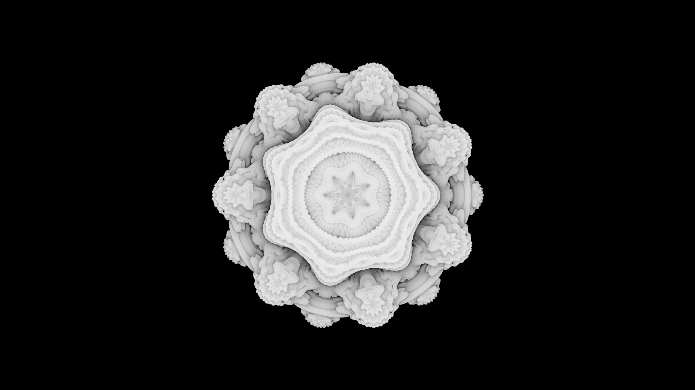

# C++ Ray-marcher

Simple C++ ray-marcher that outputs a .ppm file.
 - Has random super-sampling
 - Multi-threading (went from 2:16 -> 0:14 on my machine)

The following image is a 1920x1080 Mandlebulb generated with 8 samples per pixel:

