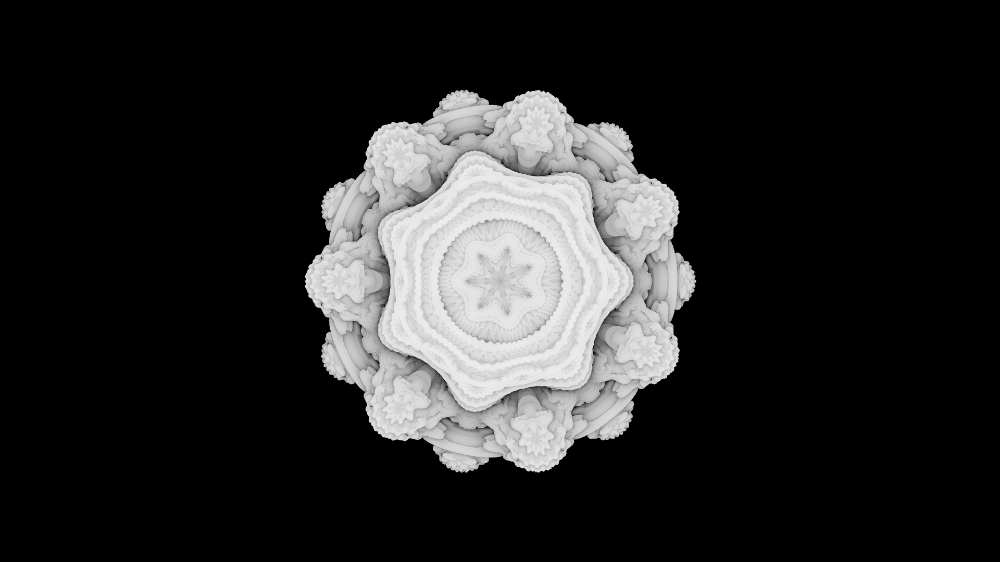

# C++ Ray-marcher

Simple C++ ray-marcher that outputs a .ppm files.
 - Has random super-sampling
 - Multi-threading (went from 2:16 -> 0:14 on my machine)
 - Shadows
 - Camera animation support
 - Animations of 4D SDFs by taking 3D slices 

The following image is a 1920x1080 Mandlebulb generated with 8 samples per pixel:



There are videos in the `samples` sub-directory along with some more images.

### CUDA

There's also a separate (unoptimised) CUDA implementation. Compared to the CPU multi-threaded version that takes 14 seconds, this renders a frame in under a second (RTX 4060 Laptop GPU).

Compile with:
```
nvcc main.cu -lcurand
```